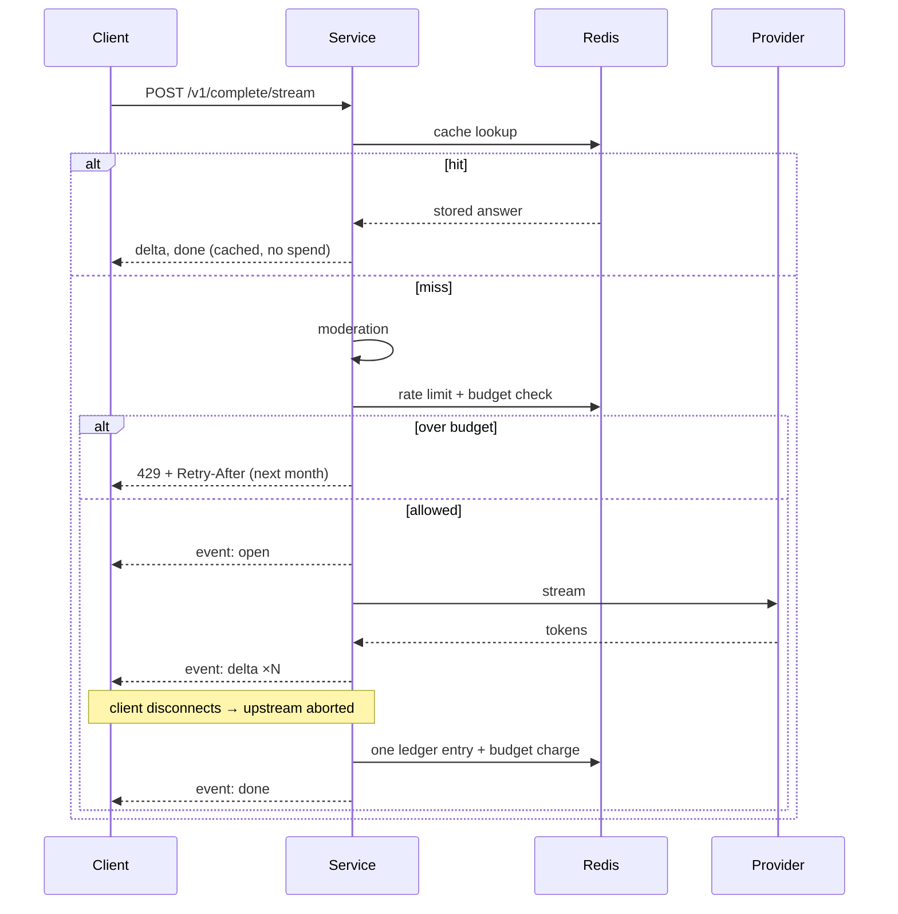

# llm-service-starter

[](https://github.com/mohadjillani/llm-service-starter/actions/workflows/ci.yml)
[](LICENSE)

Calling a model is one line. Everything around that line is the service: what to
do when the provider returns 429, what happens when the client closes the tab
halfway through a stream, what this month has cost so far, and which version of
the prompt produced last Tuesday's output.

This is an Express + TypeScript starter for that surrounding work — streaming
with cancellation, a retry policy that knows when _not_ to retry, a cost ledger,
a monthly budget breaker, a response cache and versioned prompt templates.

A mock provider ships as a first-class implementation, so all of it runs, and is
tested, with **no API key and no Redis**:

```sh
npm ci && npm run demo
```

## What it does



The chain is fixed — cache, moderation, rate limit, budget, provider — and each
step is where it is for a reason. A cache hit costs nothing upstream, so it is
not gated on a rate limit that exists to protect the upstream. Moderation runs
after the cache because a stored answer was checked when it was stored, and
before the budget guard because a request that will be refused should not
consume budget.

## Quick start

```sh
npm ci
npm run demo                    # five requests against the mock, then the ledger
npm test                        # the whole suite, no key needed
docker compose up -d --wait api # the service and its Redis, still on the mock
```

Against a real provider:

```sh
cp .env.example .env            # set PROVIDER=openai and OPENAI_API_KEY
npm run dev
```

```sh
curl -X POST localhost:3000/v1/complete \
  -H 'content-type: application/json' \
  -d '{"template":"summarize@v2","variables":{"text":"...","max_words":40}}'
```

### `npm run demo`

Real output, reproducible with that one command:

```
provider: mock (no API key, no Redis)

plain prompt             200  cached=false
  The line reopens on Monday after signalling work; reduced frequency for a week.

template summarize@v1    200  cached=false
  Migration moved 4.2m rows in eleven hours, limited by replica lag, with no failed requests.

template summarize@v2    200  cached=false
  The office moves to the third floor on Friday.

repeat of the first     200  cached=true

streamed request        200  15 SSE frames

ledger summary:
  requests          5
  prompt tokens     105
  completion tokens 88
  cost              $0.000000  (mock provider is priced at 0)
  by outcome        {"ok":5}
```

The mock prices itself at zero, so a demo can never look like it spent money.

## The decisions worth arguing about

### Retries stop once a stream has started

Retrying a failed stream looks harmless from the server. It is not: the client
already holds the first half of one answer, and a second attempt appends the
middle of a different one — producing a response that parses fine and means
nothing. So a stream is retryable before its first token and never after.

Backoff is full jitter rather than a fixed schedule, because every client that
hit the same rate limit hit it at the same moment, and backing off by a fixed
amount brings them all back together to hit it again. Only 408, 429, 5xx and
network errors are retried; a 400 or a refusal is a fact about the request, and
repeating it buys the same answer twice. ([ADR 0002](docs/adr/0002-retries-stop-at-the-first-token.md))

### A disconnected client cancels the upstream call

When the browser tab closes, the provider does not know. Without an abort it
keeps generating — and keeps charging — for nobody. The service listens for the
response closing and cancels upstream, then writes **one** ledger entry marked
`aborted`, because a half-delivered stream still consumed tokens and a ledger
that records only successes understates the bill exactly when things are going
wrong.

This is the repository's headline test, and writing it found two real bugs: the
handler was listening on the request rather than the response (so the abort
either fired immediately or never), and the backpressure-aware write awaited a
`drain` event that a dead socket never emits, hanging the handler and losing the
ledger entry entirely.

### Costs are integers, and the budget is one shared counter

A request costs around `$0.00006`. A month of adding numbers like that in
floating point drifts, and the drifting number is the one deciding whether to
stop spending — so spend accumulates as integers, in hundred-millionths of a
dollar, via `INCRBY` on a single key per calendar month.

Shared, because a per-process budget is not a budget: with six replicas it is
six budgets. ([ADR 0003](docs/adr/0003-costs-are-integers.md))

### An unreadable budget counter refuses traffic

`BUDGET_FAIL_MODE` defaults to `closed`. Failing closed when budget was
available rejects requests until Redis returns — recoverable and visible.
Failing open when the budget was exhausted means unbounded spend, bounded only
by how long nobody notices. An unreachable Redis also correlates with the
runaway retry loop that most needs a cap.

This makes Redis a hard dependency of serving traffic, which is a real
availability cost and the reason the setting exists.
([ADR 0006](docs/adr/0006-fail-closed-on-an-unreadable-budget.md))

### Prompts are versioned files

`src/prompts/templates/summarize@v2.md`, with frontmatter declaring its
variables. Every version stays loadable and requests name the one they want, so
two can serve traffic at once and a rollback is a parameter rather than a
deploy.

`npm run eval` renders every version against the golden cases in
`eval/cases.yaml` and reports what each costs to send:

| template     | mean prompt tokens | per 1,000 calls | vs first version |
| ------------ | ------------------ | --------------- | ---------------- |
| summarize@v1 | 60                 | $0.0090         | —                |
| summarize@v2 | 99                 | $0.0148         | +65%             |

The instruction block that makes v2 more specific is charged on every single
call. That is the kind of number that stays invisible while prompts live in
string literals. The full report is [docs/eval-report.md](docs/eval-report.md),
regenerated by `npm run eval` and checked in CI.

It deliberately does **not** score answer quality — that needs a real provider
and a defensible view of what a good answer is, and a quality number produced
from a mock would be invented.

## Configuration

Every key is in [.env.example](.env.example) and validated at boot; the process
exits rather than starting with configuration that will fail later. The ones
that change behaviour most:

| Variable                | Default  | Notes                                                             |
| ----------------------- | -------- | ----------------------------------------------------------------- |
| `PROVIDER`              | `mock`   | `mock`, `openai`, or `compatible` for any OpenAI-shaped endpoint  |
| `MONTHLY_BUDGET_USD`    | `50`     | Hard cap for the calendar month, shared across replicas           |
| `BUDGET_FAIL_MODE`      | `closed` | What to do when the counter cannot be read                        |
| `MAX_RETRIES`           | `3`      | Each attempt is charged — a request can cost 4× its nominal price |
| `REQUEST_TIMEOUT_MS`    | `30000`  | Per attempt, and for a stream only until the first token          |
| `CACHE_MODE`            | `exact`  | `exact`, `semantic` (see limits), or `off`                        |
| `RATE_LIMIT_PER_MINUTE` | `60`     | Per API key                                                       |

## API

| Endpoint                     | Purpose                                                         |
| ---------------------------- | --------------------------------------------------------------- |
| `POST /v1/complete`          | A completion. Takes `prompt` **or** `template` + `variables`    |
| `POST /v1/complete/stream`   | The same, as SSE: `open`, `delta` ×N, `done` (or `error`)       |
| `GET /v1/prompts`            | Which template versions are loaded                              |
| `GET /admin/ledger`          | Spend summary, recent entries, budget state                     |
| `GET /healthz` `GET /readyz` | Liveness; readiness fails when the budget counter is unreadable |

## Testing

102 tests, all runnable without an API key. The three that carry the design:

- **A client disconnects mid-stream** — the upstream call is cancelled, the
  provider stops producing tokens, and exactly one ledger entry is written.
- **A stream fails after its first token** — asserted by attempt count, so a
  change that "helpfully" retries fails here rather than in production.
- **The monthly cap is crossed** — 429 with a `Retry-After` that points at the
  next month; and with Redis unreachable, 503 under fail-closed and served under
  fail-open. Both run against a real Redis, because an in-process stand-in
  cannot demonstrate a counter shared between replicas.

Redis suites skip visibly without `REDIS_URL` rather than passing against a
fake. CI runs them with a service container, plus the compose stack end to end.

## Limits

- **The real OpenAI adapter is the least exercised code here.** Everything else
  is covered against the mock; that adapter needs a key and is excluded from
  coverage rather than fake-tested to inflate a number.
- **The moderator is a length check**, positioned where real moderation goes.
  Shipping a stub that looked like content moderation would be worse than
  shipping none.
- **Prompt injection is not defended against.** Template variables are
  interpolated verbatim; the structure of the prompt is fixed by the file, but a
  caller controls what goes in the slot. See [SECURITY.md](SECURITY.md).
- **The semantic cache is a linear scan** over recent entries — fine for a small
  cache, wrong for a large one. Its threshold is also not portable: the
  deterministic stand-in embedder scores a near-identical pair around 0.71 where
  a real embedding model would put it above 0.9.
- **The ledger is not a system of record.** Capped at ten thousand entries —
  hours of traffic, not months. ([ADR 0004](docs/adr/0004-ledger-is-a-capped-stream.md))
- **Budget is charged after the request**, so the one that crosses the cap is
  allowed and the next is refused.

## Future improvements

- A `/metrics` endpoint and a dashboard. The service logs cost per request but
  exposes no metrics, so no dashboard ships — one wired to metrics that do not
  exist would be decoration.
- Spend attribution per API key over long windows, which needs a database and a
  rollup rather than a capped stream.
- A scored evaluation against a real provider, reusing the same case list.
- Idempotency keys so a mid-stream failure could resume rather than restart —
  it needs provider support that does not currently exist.

## Related

Boot-time configuration validation is the pattern from
[env-guard](https://github.com/mohadjillani/env-guard), reimplemented rather
than depended on so this stays standalone. Service structure follows
[node-service-blueprint](https://github.com/mohadjillani/node-service-blueprint).
SSE is used here rather than WebSockets because the stream is one-directional
and short-lived; [socketio-scale-template](https://github.com/mohadjillani/socketio-scale-template)
covers the case where it is neither.

## License

MIT © Mohad Jillani
